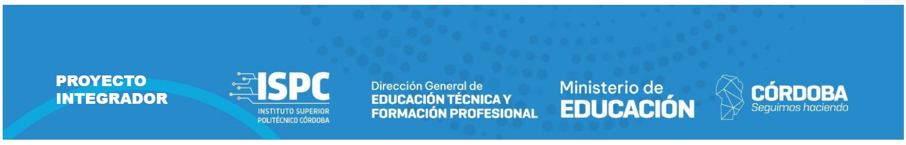

Objetivos 

## MySQL ##
 es una base de datos relacional de código abierto, basada en SQL, que sigue un modelo tabular estructurado. Los objetivos y ventajas de usar MySQL incluyen:

# Integridad de los Datos y Relaciones #
-Objetivo: Garantizar la consistencia y la integridad de los datos a través de un esquema bien definido con relaciones entre tablas.
-Ventaja: MySQL utiliza claves primarias, foráneas y restricciones para asegurar que los datos sean precisos y coherentes.

# Escalabilidad Vertical #
-Objetivo: Mejorar el rendimiento al aumentar la capacidad del hardware de un solo servidor.
-Ventaja: MySQL permite la escalabilidad vertical, que implica actualizar el servidor para manejar mayores cargas de trabajo.

# Estandarización y Conformidad #
-Objetivo: Utilizar un lenguaje de consulta estándar y bien documentado para la gestión de datos.
-Ventaja: SQL es un lenguaje ampliamente conocido y estandarizado, lo que facilita el desarrollo y la interoperabilidad.

# Transacciones y ACID #
-Objetivo: Garantizar la correcta ejecución de transacciones con propiedades ACID (Atomicidad, Consistencia, Aislamiento, Durabilidad).
-Ventaja: MySQL es adecuado para aplicaciones que requieren transacciones seguras y la capacidad de revertir cambios en caso de fallos.

# Soporte y Herramientas #
-Objetivo: Aprovechar el ecosistema maduro y amplio soporte para el desarrollo y la administración de bases de datos.
-Ventaja: MySQL cuenta con una amplia gama de herramientas y recursos para administración, respaldo, y recuperación de datos.
Resumen

## MongoDB ##
 Es una base de datos NoSQL orientada a documentos, diseñada para gestionar grandes volúmenes de datos no estructurados o semi-estructurados. Los objetivos y ventajas de usar MongoDB incluyen:

# Flexibilidad en el Modelo de Datos #
-Objetivo: Permitir una estructura de datos dinámica que se adapte fácilmente a cambios en el esquema.
-Ventaja: Los documentos en MongoDB pueden tener diferentes campos y estructuras, lo que facilita la evolución del modelo de datos sin necesidad de una migración compleja.

# Escalabilidad Horizontal #
-Objetivo: Soportar grandes volúmenes de datos y altas cargas de trabajo mediante la distribución de datos en múltiples servidores.
-Ventaja: MongoDB permite la escalabilidad horizontal mediante el sharding (particionamiento de datos), lo que facilita la expansión del sistema a medida que crecen los datos.

# Desempeño en Consultas y Almacenamiento #
-Objetivo: Ofrecer un alto rendimiento en operaciones de lectura y escritura, especialmente para aplicaciones con grandes volúmenes de datos.
-Ventaja: MongoDB está optimizado para operaciones rápidas en documentos, lo que es útil para aplicaciones que requieren alta velocidad y flexibilidad.

# Soporte para Datos No Estructurados #
-Objetivo: Almacenar y gestionar datos que no se ajustan fácilmente a un modelo tabular rígido.
-Ventaja: Ideal para aplicaciones que manejan datos semiestructurados, como JSON, o datos que cambian frecuentemente.

# Consulta y Agregación Avanzada #
-Objetivo: Proporcionar capacidades robustas para consultas y procesamiento de datos.
-Ventaja: MongoDB ofrece un potente marco de agregación que permite realizar análisis y transformaciones complejas de datos.